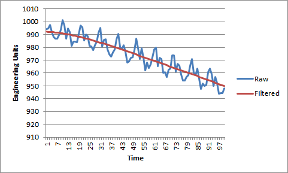

# dig-filt-sandbox

A discussion regarding [computational-science](https://gitter.im/exercism/computational-science) was opened recently and it is looking for topics for potential development of exercises for [Exercism.io](http://exercism.io).  I have suggested that perhaps digital filtering could be an interesting topic to explore.  I plan to share some examples of some software filters that I have been using for years that will hopefully aid in the discussion and foster the development of some new and interesting exercises.

This repo may be used as a place to display thoughts / ideas regarding digital filters.

My examples are written in Pascal.  This should not deter you from sharing your ideas in whatever language you like.  This should be considered a language agnostic place to explore this topic.

I have provided two examples to start the conversation:  
- **[Butterworth Filter](https://en.wikipedia.org/wiki/Butterworth_filter)**  
- **[Median Spike Filter](https://www.mathworks.com/help/signal/ug/remove-spikes-from-a-signal.html?requestedDomain=www.mathworks.com)** *wikipedia didn't have anything on the topic*

Raw vs. Filtered Data:

Ryan 